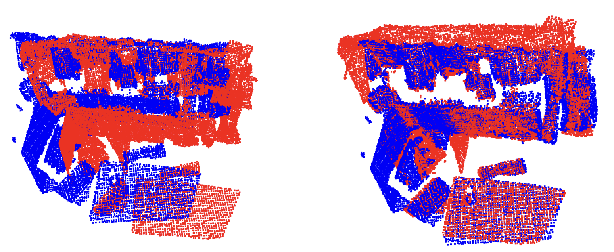
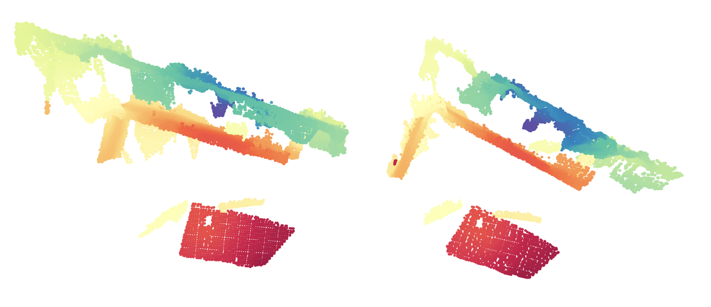
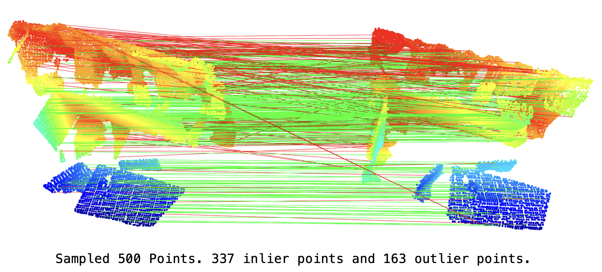
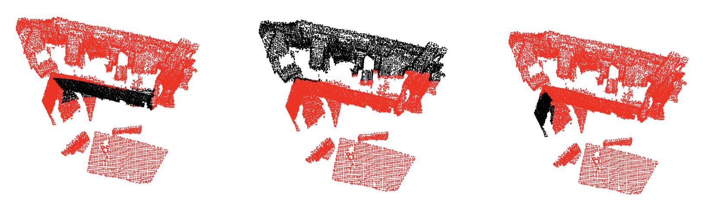

# Open3D Visualization Tools

## List
- Point Cloud Transformation
- Point Cloud Feature Visualization
- Point Cloud Registration
- Segment Visualization
- ...

## Visualization

### Point Cloud Transformation

    

### Point Cloud Feature Visualization

    

### Point Cloud Registration

    

### Segment Visualization

    

